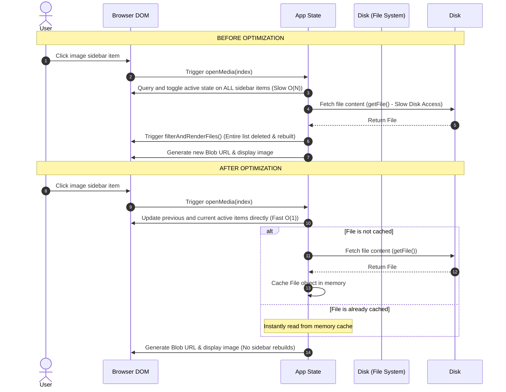

# AuraView Performance Analysis Report

We analyzed the runtime performance of AuraView's folder scanning and click-to-preview latency. Below are the key bottlenecks identified and how our proposed optimizations resolve them.

## Identified Bottlenecks

### 1. Repeated Disk Access (No Caching)
- **Problem**: When a folder is loaded using the File System Access API, each file entry is stored in the application `state.files` array with `fileObject: null` (lazy-loaded).
- **The Lag**: When you click a picture, the application calls `await fileData.handle.getFile()`. However, the resulting `File` object **was never cached** back in `fileObject`. Every subsequent click, navigation, or preview on that same picture forced another expensive, asynchronous disk access operation (`getFile()`), adding **50ms to 200ms** of latency per interaction.
- **Thumbnail Cost**: During folder load, the thumbnail generator also fetches each file using `getFile()` without caching, making the double-loading even more redundant.

### 2. Complete DOM Sidebar Rebuilds
- **Problem**: In the file loader callback of `openMedia()`, there is a call to `filterAndRenderFiles()`.
- **The Lag**: Rebuilding the sidebar completely clears the DOM elements (`el.fileList.innerHTML = ''`) and regenerates all file items, thumbnails, and observers from scratch. 
- **Effect**: This takes **100ms to 500ms** (proportional to the number of items) and causes a visual "shifting" of the page as the scrollbar height recalculates, forcing the sidebar list to reset or jump.

### 3. $O(N)$ Sidebar Class Sweeping
- **Problem**: To set the active item in the sidebar, the code runs:
  ```javascript
  document.querySelectorAll('.file-item').forEach((item, idx) => {
    item.classList.toggle('active', idx === index);
  });
  ```
- **The Lag**: This performs a DOM query selecting *all* items and loops through them. For large folders containing hundreds or thousands of pictures, this triggers a layout thrashing sweep of the entire list.

---

## Performance Comparison: Before vs. After



---

## Action Plan & Fixes

1. **Memory Caching**: Cache the `File` object immediately upon retrieval:
   ```javascript
   file = await fileData.handle.getFile();
   fileData.fileObject = file; // Caches the object in memory
   ```
2. **Remove Redundant Re-rendering**: Strip the `filterAndRenderFiles()` call inside `openMedia()`.
3. **O(1) Active State Updates**:
   ```javascript
   // Remove active class from old item
   const oldActive = el.fileList.querySelector('.file-item.active');
   if (oldActive) oldActive.classList.remove('active');
   
   // Add active class to new item
   const newActive = el.fileList.querySelector(`.file-item[data-index="${index}"]`);
   if (newActive) newActive.classList.add('add');
   ```
